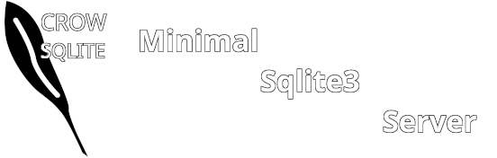

# 

`CrowSqlite` is a **Minimal SQLite3 Restful Database Server** intended to run locally and operated by a specific software to be used as a simple database.


# Compiling


Before Compiling `CrowSqlite` you should take a look at avaiable define flags which enables or disables certain features, change them as you need.

Current flags include:
```
#define CSQL_CONSOLE_PRINT // Enables Console logging | useful if you don't care about console logs
#define CSQL_HTTP_LOGGER // Enables the view of logs using /logs url
#define CSQL_EXEC_SQL // Enables execution of SQL queries using /sql
#define CSQL_PREPARE_SQL // Enables Preparing and using Sqlite3 statements
```

Note: By default all flags are enabled, if you wish to disable them, you need to edit `main.cpp`, and comment the `#define` for the corresponding flag.

Compile is as simple as running a `make` command

# How to use it

If you enabled `CSQL_EXEC_SQL` Flag you could execute any valid SQL command by sending it using HTTP to `localhost:PORT/sql/YOUR_QUERY`, the return result will be in Json format.

If you enabled `CSQL_PREPARE_SQL` You could prepare an Sqlite3 statement using `localhost:PORT/pre/YOUR_QUERY` and then execute this statement using `localhost:PORT/use/STATEMENT_INDEX`, with `STATEMENT_INDEX` being the the order in which the desired statement was created, so the first statement created has an index of 0, the second has index of 1, and so on.

If you enabled `CSQL_HTTP_LOGGER` You could fetch logs using HTTP by using `localhost:PORT/logs`

If you enabled `CSQL_CONSOLE_PRINT` logs will be printed on the console.

# Arguments

```
Argument List:

         -d              Absolute path to the database file
         -p              Port Number (Default: 12000)
         -h              Print help text
```

# Note

`CrowSqlite` was never tested on other platforms beside `windows`, and its `Makefile` is only desgined to compile for windows.

# TODO

Some feature plans for `CrowSqlite` include

- [ ] Remove absolute path limitation
- [ ] Include Protocols other than HTTP
- [ ] Improve `url_decoder` function so it handles all sorts of possible SQL Queries special characters
- [ ] Add saving logs to a file when `logs` variable becomes large
- [ ] Find a minimal and optimal replacement for `<string>`
- [ ] Support for other platforms
- [ ] Improve compile optimization flags
- [ ] Include colored output (**only if it doesn't add bloat**)

# License
`CrowSqlite` is licensed under MIT license.

Its dependencies are licensed under their own licenses.

A copy of dependency license is provided in the dependency corresponding folder.
